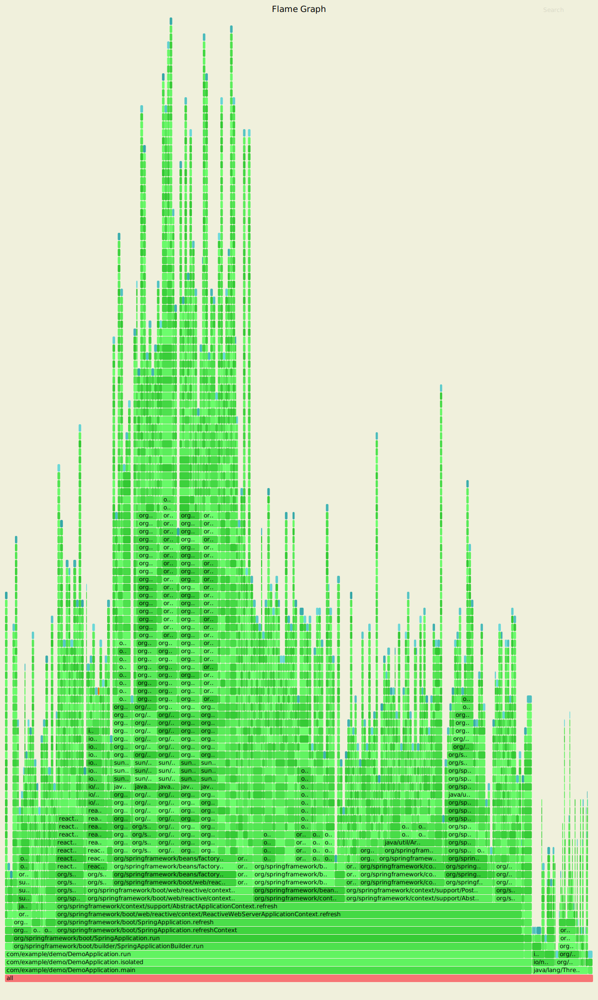
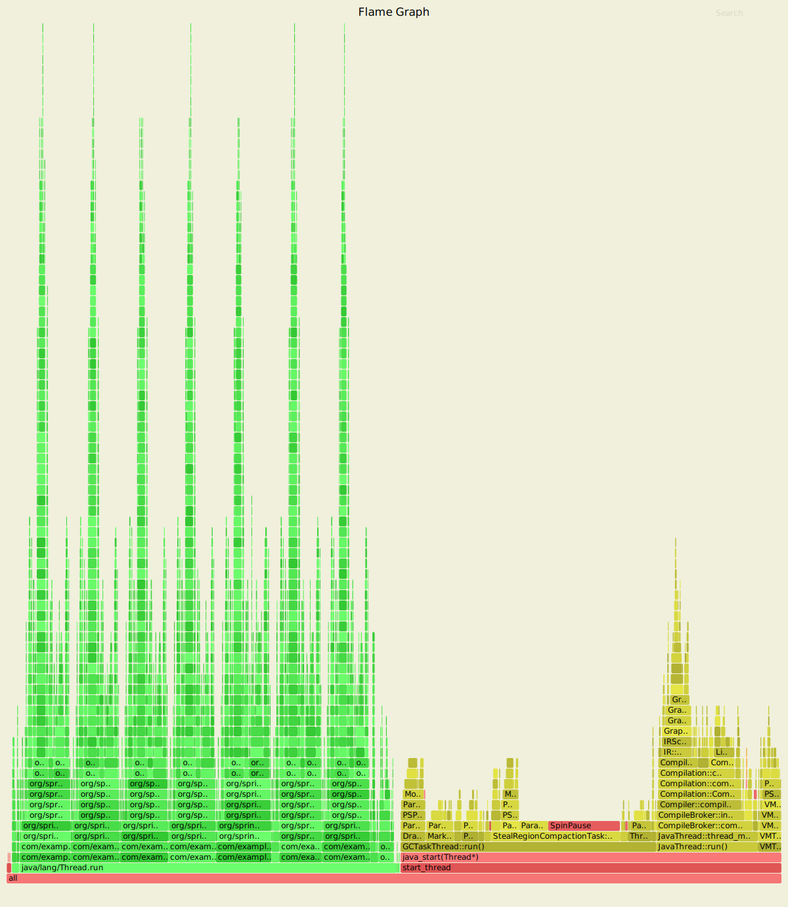

Laptop results:

```
Benchmark               Mode  Cnt  Score   Error  Units
MainBenchmark.isolated    ss   10  1.305 ± 0.162   s/op
MainBenchmark.shared      ss   10  0.257 ± 0.094   s/op
```

* "isolated" means a new class loader per application context (so all
the Spring metadata has to be read again because caches get cleared).
* "shared" means the same class loader for all contexts. In principal
this is as fast as we can ever go (things will always be a bit slower
because classes have to be loaded).

Without `spring.components`:

```
Benchmark               Mode  Cnt  Score   Error  Units
MainBenchmark.isolated    ss   10  1.331 ± 0.145   s/op
MainBenchmark.shared      ss   10  0.290 ± 0.072   s/op
```

The error bars are large, but there may be a small difference that is
worth keeping, even from such a minor change.

== GC Data

Run the app with `-verbose:gc -XX:+PrintGCDetails
-XX:+PrintGCTimeStamps` to see GC pauses. E.g.

```
1.595: [Full GC (System.gc()) [PSYoungGen: 2080K->0K(23552K)] [ParOldGen: 11028K->11106K(55296K)] 13109K->11106K(78848K), [Metaspace: 23083K->23083K(1071104K)], 0.0511875 secs] [Times: user=0.15 sys=0.00, real=0.05 secs] 
```

Total time 200ms.

== Flame Graphs

Run the app with this arguments:

```
-Ddemo.count=1000000 -Xmx128m -noverify -XX:TieredStopAtLevel=1
```

and attach a https://github.com/jvm-profiling-tools/async-profiler[profiler]:

```
$ profiler.sh d 10 -e alloc -o svg=total -f /tmp/flame.svg jps
```

> HINT: you can click on the flames to zoom in on the stack above
> where you click.

Without thread isolation for each application (revert commit
d8de95ddf), the tiny little flickers at the top are one per
application instance, but all instances seem to share metrics for the
base of the fire in Spring.



With thread isolation (branch "master") each "hump" in the graph is a
single instance of the app (in its own classloader and its own
thread). As a result it's easier to focus on a single application
lifecycle:

image::images/flame_thread.svg[thread]

Same but with `-e cpu` (which I think is the default), showing that
garbage collection and "brown" (non TLAB) allocations are a heavy tax:



== Ideas

* Up to now the strategy has been "use ASM and cache like crazy, run
everything dynamically". What about precomputing all that stuff?

* `@ComponentScan` -> `spring.components` and it seems to make very
little difference (but every little helps).

* What about `@Import`? A large fraction of configuration class
processing is taken up with `@Import`.

* `BeanInfoFactory` isn't a big footprint on the flame graphs, but
it's not minute either.

* `ConfigurationClassPostProcessor` does a lot of imports and metadata
reading. It always shows up in the flame graphs.

* CGILib: might not be slow at all actually, but it comes in for some
stick generally. Worth a look.

* Webflux is the other big hog in the simple demo application, after
from `@Configuration` (Netty itself is relatively fast). Maybe that
can be streamlined as well?