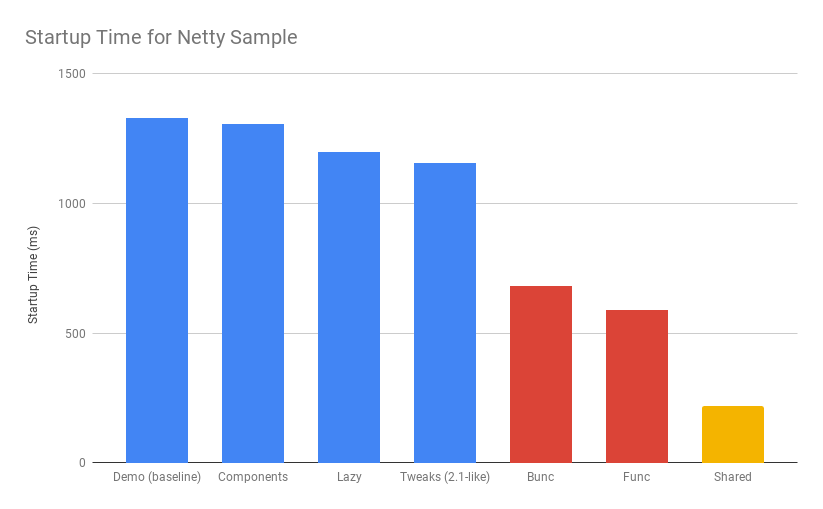
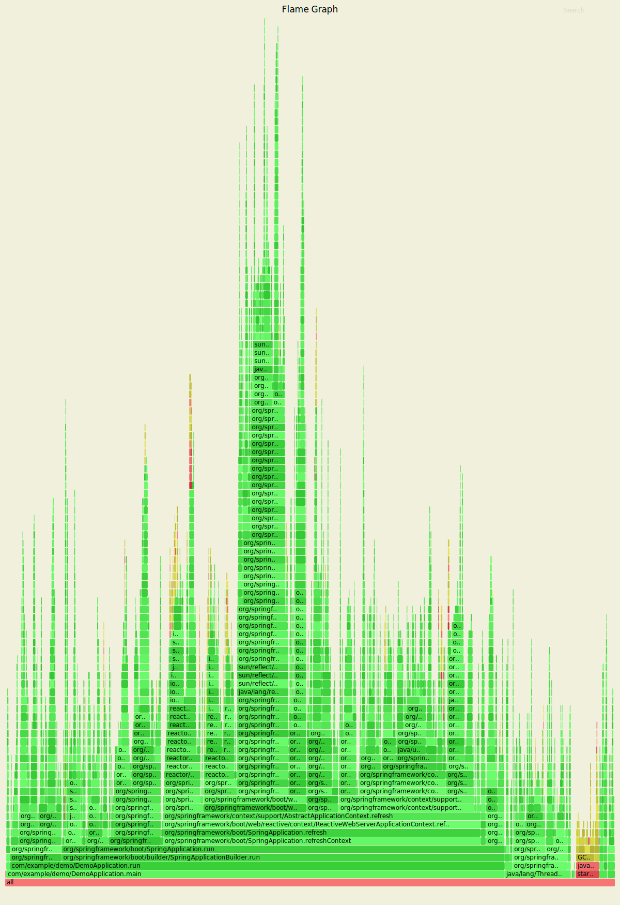
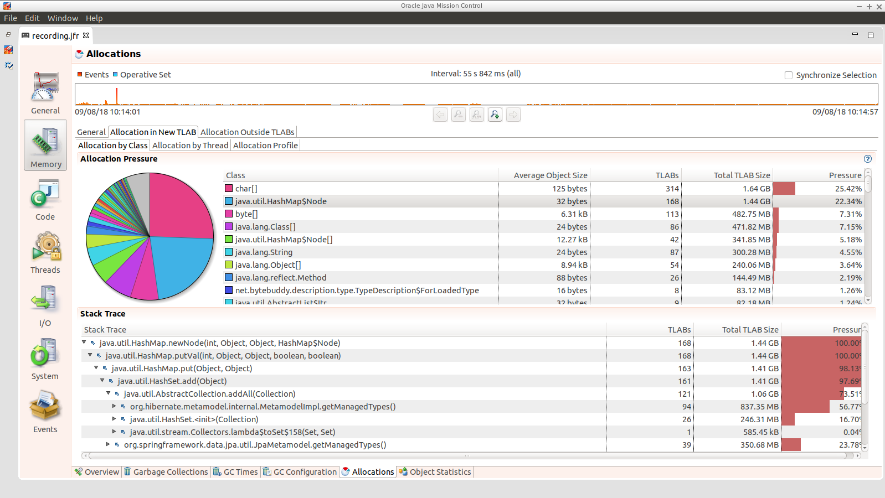

This project contains some benchmarks on Spring Boot startup time. The
findings here have shown us how to make several optimizations in
Spring Boot 2.1 and Spring 5.1, so those are highlighted. The
optimizations and quite a few of the focused benchmarks concentrate on
memory allocations and garbage collection pressure, which are hard to
measure, but quite easy to run into problems with on startup.

There is a more extensive but older set of benchmarks
https://github.com/dsyer/spring-boot-startup-bench[elsewhere] that you
also might find interesting.

== TL;DR How do I make my app go faster?

You are mostly going to have to drop features, so not all of these
suggestions will be possible for all apps. Some are not so painful,
and actually pretty natural in a container, e.g. if you are building a
docker image it's better to unpack the jar and put application classes
in a different filesystem layer anyway.

* Classpath exclusions from Spring Boot web starters:
  - Hibernate Validator
  - Jackson (but Spring Boot actuators depend on it). Use
    Gson if you need JSON rendering (only works with MVC out of the box).
  - Logback: use `slf4j-jdk14` instead
* Use the `spring-context-indexer`. It's not going to add much, but
Spring Boot autoconfiguration is indexed, and every little helps.
* Don't use actuators if you can afford not to.
* Use Spring Boot 2.1 and Spring 5.1 when they are available.
* Fix the location of the
https://docs.spring.io/spring-boot/docs/current/reference/htmlsingle/#boot-features-external-config-application-property-files[Spring Boot config file(s)]
with `spring.config.location` (command line argument or System property etc.).
Example for testing in IDE:
`spring.config.location=file://./src/main/resources/application.properties`.
* Switch off JMX if you don't need it with `spring.jmx.enabled=false`
* Make bean definitions lazy by default. There's nothing in Spring
Boot that does this, but there's a `LazyInitBeanFactoryPostProcessor`
in this project you can copy.
* Unpack the fat jar and run with an explicit classpath.
* Run the JVM with `-noverify`. Also consider `-XX:TieredStopAtLevel=1`
(that will slow down the JIT later at the expense of the saved startup time).

A more extreme choice is to re-write all your application
configuration using functional bean definitions. This includes all the
Spring Boot autoconfiguration you are using, most of which can be
re-used, but it's stll manual work to identify which classes to use
and register all the bean definitions. If you try this approach you
might see a 2x improvement in startup time. Look at the
`BuncApplication` to see how to start Spring Boot without the
`@Configuration` class processor.

Excluding `netty-transport-native-epoll` also boosts the functional
bean apps by about 30ms (but not noticeably the non-functional ones),
so maybe a few percent.

== Summary of Results

Here is a graph that summarizes the results, in terms of how the
startup time of the sample app (a single HTTP endpoint using Netty)
behaves when we apply various changes:



The blue bars show successive improvements in the vanilla "demo"
sample (a fully-leaded Spring Boot application). Once all the tweaks
are applied we can see approximately a 200ms improvement (>15%).

* The "Demo (baseline)" bar is the first benchmark we measured. It
measures the time to start the app in a fresh class loader, but in a
warm JVM, so it's a little bit quicker in absolute terms than a cold
start (by maybe 10%).

* The "Components" bar is what happens if you use the
`spring.components` index (just by adding `spring-context-indexer` to
the classpath). It's a tiny app so we don't expect a huge effect, but
it is measurable.

* "Lazy" is what happens if you make all bean definitions lazy by
default. Some Spring Boot autoconfiguration is not used at runtime, so
you can save a bit of time by not using it.

* "Tweaks" is the result of applying a few changes to Spring Framework
and Spring Boot (which are pretty similar to what you will probably
find in Spring Boot 2.1 and Spring 5.1). It also includes the JMX and
config file location adjustments.

The red bars are the same app but converted to functional bean
registration. "Bunc" uses Spring Boot and "Func" does not (so it loses
the benefit of config file parsing and other stuff that Spring Boot
does on startup). They represent approximately 2x
improvement over the baseline.

The yellow bar is the same app but started from a completely warm JVM
and the same classloader repeatedly. This is approximately 6.5 times
faster than the baseline (200ms start time). It's a useful yardstick
of what the JVM can do if you allow it to optimize itself. Who knows,
maybe one day the optimizations could be cached and re-loaded quickly
enough for this to be a cold start. Some features of the modern JVM
(JEP 310 for example) are moving in this direction, but unfortunately
are nowhere near achieving the same level of improvement.

== Early Improvements in Spring Boot 2.1

Spring Boot 2.1 is not even in the milestone as this work is being
done, but we have managed to push a few changes into Spring Boot and
Spring Framework 5.1. Here's a quick summary of the startup times:

image::https://docs.google.com/spreadsheets/d/e/2PACX-1vQpSEfx0Y1W9aD3XVyn91-S0jtUp2DRCQSy_W_LMGyMR91YLAQ1mL7MiR1BRd8VzshvtuxzL6WAnlxf/pubchart?oid=1818051570&format=image[startup-2.1.x,width=75%]

The "Freemarker" and "Tomcat" samples are from the Spring Boot
project. The "Demo" and "Bunc" samples are the ones from this project.

This is the effect on heap memory usage (plotting startup time vs max
heap memory):

image::https://docs.google.com/spreadsheets/d/e/2PACX-1vQpSEfx0Y1W9aD3XVyn91-S0jtUp2DRCQSy_W_LMGyMR91YLAQ1mL7MiR1BRd8VzshvtuxzL6WAnlxf/pubchart?oid=1685708082&format=image[heap-size-2.1.x,width=75%]

Note that it is quite possible to run a simple Netty app in 10-12MB
heap with Spring Boot 2.1 (but not with 2.0).

Most if not all the improvements here some from the
`AbstractAutowireCapableBeanFactory` changes (see below for
details). The change is also readily visible in flame graphs from a
profiler (see below for details):

[cols="52a,48a"]
|===
|image::images/flame_20.svg[flame_20]
|image::images/flame_21.svg[flame_21]

| Spring Boot 2.0
| Spring Boot 2.1
|===

The red/brown GC flame on the right is noticeably smaller in Spring
Boot 2.1. This is a sign of less GC pressure caused by the bean
factory change.

== Detailed Notes and Numerical Results

Laptop results:

```
Benchmark               Mode  Cnt  Score   Error  Units
MainBenchmark.demo        ss   10  1.305 ± 0.162   s/op
MainBenchmark.shared      ss   10  0.257 ± 0.094   s/op
```

* "demo" creates a new class loader per application context (so all
the Spring metadata has to be read again because caches get cleared).
* "shared" means the same class loader for all contexts. In principal
this is as fast as we can ever go (things will always be a bit slower
because classes have to be loaded).

Without `spring.components`:

```
Benchmark               Mode  Cnt  Score   Error  Units
MainBenchmark.demo        ss   10  1.331 ± 0.145   s/op
MainBenchmark.shared      ss   10  0.290 ± 0.072   s/op
```

The error bars are large, but there may be a small difference that is
worth keeping, even from such a minor change.

With `LazyInitBeanFactoryPostProcessor` (quite a useful boost):

```
Benchmark               Mode  Cnt  Score   Error  Units
MainBenchmark.demo        ss   10  1.197 ± 0.188   s/op
MainBenchmark.shared      ss   10  0.226 ± 0.067   s/op
```

See also the https://github.com/dsyer/spring-boot-micro-apps[Micro
Apps] repo, where you will find the same sample apps but not the
benchmarks. This makes them easier to just run in an ad-hoc way, if
you want to just mess around. It is also where we are teaching Spring
to play with https://github.com/oracle/graal/[GraalVM].

=== Desktop Results

Vanilla:

```
Benchmark               Mode  Cnt  Score   Error  Units
MainBenchmark.demo        ss   10  0.768 ± 0.110   s/op
MainBenchmark.shared      ss   10  0.159 ± 0.048   s/op
```

and with `LazyInitBeanFactoryPostProcessor`:

```
Benchmark               Mode  Cnt  Score   Error  Units
MainBenchmark.demo        ss   10  0.696 ± 0.068   s/op
MainBenchmark.shared      ss   10  0.131 ± 0.024   s/op
```

== GC Data

Run the app with `-verbose:gc -XX:+PrintGCDetails
-XX:+PrintGCTimeStamps` to see GC pauses. E.g.

```
1.595: [Full GC (System.gc()) [PSYoungGen: 2080K->0K(23552K)] [ParOldGen: 11028K->11106K(55296K)] 13109K->11106K(78848K), [Metaspace: 23083K->23083K(1071104K)], 0.0511875 secs] [Times: user=0.15 sys=0.00, real=0.05 secs] 
```

Total time 200ms.

== Flame Graphs

On linux, prepare your system to accept the necessary system calls:

```
$ echo 1 | sudo tee /proc/sys/kernel/perf_event_paranoid
```

Otherwise you will see a lot of `perf_event_open failed: Permission denied` when you run the profiler.

Download the https://github.com/jvm-profiling-tools/async-profiler[profiler] and run the app with these arguments:

```
-agentpath:<path-to>/async-profiler/build/libasyncProfiler.so=start,svg,file=/tmp/flame.svg,event=cpu,interval=100000 -Ddemo.close=true -Xmx128m -noverify -XX:TieredStopAtLevel=1
```

> HINT: you can click on the flames to zoom in on the stack above
> where you click.

[cols="50a,50a"]
|===
|image::images/flame_vanilla.svg[thread]
|image::images/flame_lazee.svg[lazy]

| Vanilla demo app
| Same but with the `LazyInitBeanFactoryPostProcessor`
|===

Notice the different (thinner) profile for the right hand "rump"
containing `ConfigurationClassPostProcessor`.

There is a `MicroApplication` (no `@Configuration` and no Spring Boot)
that starts up very quickly. Here's a flame graph:

image::images/flame_micro.svg[cpu,width=50%]

Note that there is very little time spent on garbage collection, and
of course nothing from `ConfigurationClassPostProcessor`.

NOTE: if you are using Spring Tool Suite be sure to shut down the
invasive JVM agent attach feature (`Window >> Preferences >> Spring >>
Boot Language Server Extension` uncheck all boxes) before you generate
flame graphs from Java application launchers. Otherwise you get noise
from Eclipse trying to connect to your app and inspect it.

== Ideas

* Up to now the strategy has been "use ASM and cache like crazy, run
everything dynamically". What about precomputing all that stuff?

* `@ComponentScan` -> `spring.components` and it seems to make very
little difference (but every little helps).

* What about `@Import`? A large fraction of configuration class
processing is taken up with `@Import`.

* `BeanInfoFactory` isn't a big footprint on the flame graphs, but
it's not minute either.

* `ConfigurationClassPostProcessor` does a lot of imports and metadata
reading. It always shows up in the flame graphs.

* CGLib: might not be slow at all actually, but it comes in for some
stick generally. Worth a look.

* Webflux is the other big hog in the simple demo application, after
`@Configuration` (Netty itself is relatively fast). Maybe that can be
streamlined as well?

Sifting through some flame graphs and other hints and data points, we
came to the conclusion that there are maybe 3 areas that are worth
some more research:

* `ConfigurationClassPostProcessor` is definitely up there and you can
quite easily change the `MetadataReaderFactory` it uses (Spring Boot
already boosts performance that way). We tried to serialize the
metadata, but the existing implementation is not serializable and
cannot easily be made so. There are some concerns about the fragility
of the annotation metadata implementations that are in use already
(one is ASM based and the other needs classes to be loaded). We need
the ASM-generated data for `ConfigurationClassPostProcessor`.

* CGLib *is* a bit slow, compared to vanilla reflective access. So
replacing the proxies in `@Configuration` processing might be a good
idea. Phil had some code that did this but he thought it didn't make
enough difference to continue (see
https://github.com/philwebb/spring-framework/tree/config-processor[here]).

* Bean creation is expensive still. `BeanWrapper` and `BeanInfo` are
right in the centre of that. There is a `BeanInfo` implementation in
this project (from Phil again) but it doesn't have any measurable
effect. Something else might work. The place to start looking is
`AbstractAutowireCapableBeanFactory` where the `doCreateBean()` method
could be replaced.

* Also Spring Boot condition messages create strings and concatenate
them even if they might never be used. this shows up a GC churn.

* `AnnotationTypeFilter` looks like another potential
optimization. It's >1% of startup time in the fastest app, and all it
needs to know is "Does `@Component` have `@Inherited`?" it seems.

* `MimeTypeUtils` has a `SecureRandom` and it is used by WebFlux to
initialize a codec, which is pretty fundamental, but takes 1.4% of
startup time in the fastest app. Setting
`-Djava.security.egd=file:/dev/./urandom` doesn't help.

* `DispatcherHandler` eagerly initializes a bunch of stuff (handler
mappings etc.) which is the biggest part of the WebFlux startup
flame. It doesn't seem to help much to make it lazy though - the flame
goes away but startup time is not improved.

* `ConfigFileApplicationListener` (5.5%) and
`LoggingApplicationListener` (2.2%) are two big differences between
the non-Boot and Boot samples.

== Hacking AbstractAutowireCapableBeanFactory

See https://jira.spring.io/browse/SPR-16918[SPR-16918]. This little hack:

```java
//            PropertyDescriptor[] filteredPds = filterPropertyDescriptorsForDependencyCheck(
//                    bw, mbd.allowCaching);
            PropertyDescriptor[] filteredPds = new PropertyDescriptor[0];
```

makes things really zippy:

```
Benchmark               Mode  Cnt  Score   Error  Units
MainBenchmark.demo        ss   10  1.234 ± 0.195   s/op
MainBenchmark.boot        ss   10  1.145 ± 0.192   s/op
MainBenchmark.shared      ss   10  0.227 ± 0.070   s/op
```

With that change and some other minor tweaks (see below), you can run
the vanilla `DemoApplication` in 8m of heap (it starts a bit slowly
but runs fine). With 12m heap you see a lot more GC logged, but it
isn't much slower. Flame graph:



== Functional Bean Registration

See also https://jira.spring.io/browse/SPR-16973[SPR-16973],
https://jira.spring.io/browse/SPR-8891[SPR-8891],
https://jira.spring.io/browse/SPR-16959[SPR-16959],
https://jira.spring.io/browse/SPR-15197[SPR-15197],
https://jira.spring.io/browse/SPR-17057[SPR-17057],
https://jira.spring.io/browse/SPR-17063[SPR-17063].

Getting rid of as much `@Configuration` as possible would give us a
way to measure the effect of any inefficiencies in that area more
precisely. There is a Spring Boot issue that talks about supporting
functional bean registration for user beans
(https://github.com/spring-projects/spring-boot/issues/8115[Boot#8115]),
but that doesn't cover the autoconfigs. There are some benchmarks
https://github.com/dsyer/spring-boot-startup-bench/blob/master/static/README.adoc[here]
that show how fast an app with functional bean registration can be,
but the conclusion there was that the improvement was more to do with
fewer features. Time to do some more tests.

Here are some results:

```
Benchmark               Mode  Cnt  Score   Error  Units
MainBenchmark.demo        ss   10  1.156 ± 0.203   s/op
MainBenchmark.boot        ss   10  1.115 ± 0.210   s/op
MainBenchmark.manual      ss   10  1.068 ± 0.185   s/op
MainBenchmark.auto        ss   10  0.778 ± 0.202   s/op
MainBenchmark.bunc        ss   10  0.683 ± 0.147   s/op
MainBenchmark.func        ss   10  0.573 ± 0.149   s/op
MainBenchmark.shared      ss   10  0.219 ± 0.070   s/op
```

* "demo" is the canonical `DemoApplication` with `@SpringBootApplication`.

* "boot" uses `SpringApplication` but not
`@EnableAutoConfiguration`. It is a bit quicker (40ms or 4%). The
flame graph for this one has much less GC activity.

* "manual" is the same but gets rid of `SpringApplication`. Another
50ms improvement.

* "bunc" registers all beans in the application directly, by class or
using the functional bean registration API. It uses
`SpringApplication` (so all of Boot except autoconfig, basically), but
it switches off the `ConfigurationClassPostProcessor`.

* "func" creates the application context by hand, forgoing the
benefits of Spring Boot. Results are pretty good (first sample under
1000ms).

* "auto" is a hybrid - it uses functional bean registrations generated
using reflection from existing autoconfiguration. It is fully
automated (unlike "func" and    "bunc") and uses all the features of Spring
Boot. You can try this yourself by using the library
https://github.com/dsyer/spring-boot-auto-reflect[spring-boot-auto-reflect].

Some of the `@Configuration` beans are hard to use without registering
them as beans
(e.g. `WebFluxAutoConfiguration.EnableWebFluxConfiguration`). If you
do register a `@Configuration` manually (not using `@Import` or
`@ComponentScan`) there is still some post processing and reflective
calling of `@Bean` methods etc., but the CGLib proxy is skipped (might
have side effects, so probably not a good idea in general).

Here are some flame graphs from the functional bean samples:

[cols="33a,33a,33a"]
|===
|image::images/flame_func.svg[func]
|image::images/flame_bunc.svg[bunc]
|image::images/flame_auto.svg[auto]

| "func"
| "bunc"
| "auto"
|===

Note that `ConfigurationClassPostProcessor` is not used at all. If it
was it would still account for 6% of the startup time because it
inspects every bean in the context, even though there we know there
are no `@Configuration` classes. To achieve this extra optimization
the user has to ensure that the application context is not one of the
annotation register implementations
(e.g. `ReactiveWebServerApplicationContext` instead of
`AnnotationConfigReactiveWebServerApplicationContext`) but also that
it does register an `AutowiredAnnotationBeanPostProcessor`.

The biggest flame on the "func" app graph was
`@ConfigurationProperties` processing (9%), but most of that was
initializing the conversion service, which is done in a background
thread in a Boot app. The timing shown above puts it in a background
thread (saving about 50ms).

We suspect that the difference between "demo" (vanilla) and "boot"
is condition processing, and that string manipulation can be removed
or optimized in Boot to reduce or eliminate that. Attempting to
collect evidence for this has so far failed. E.g. using this
https://github.com/wilkinsona/spring-boot/tree/empty-condition-messages[branch
of Spring Boot] didn't have much impact on any but the "boot" sample
(it should have improved the "demo" sample as much or more).

The biggest flame in the "boot" graph that isn't in the "manual" one
is from `BackgroundPreinitializer`. That's in a background thread, so
it isn't obviously going to slow down the startup, but if it causes
extra GC pressure, in particular that could be bad. See
https://github.com/spring-projects/spring-boot/issues/13423[spring-boot#1423]. It
makes quite a big difference (about 60ms). The data above already
include this improvement.

You can start the `FuncApplication` in 12m heap without degrading
it. It runs in 8m but a bit slower, much slower in 6m, and fails to
start in 4m. GC is down to 3% of startup time in the "func" sample,
and 8% in "demo" (the fully-leaded `DemoApplication`).

With the `LazyInitBeanFactoryPostProcessor`:

```
Benchmark               Mode  Cnt  Score   Error  Units
MainBenchmark.bunc        ss   10  0.653 ± 0.154   s/op
MainBenchmark.func        ss   10  0.523 ± 0.132   s/op
```

In all 17 beans are not created in "bunc" on startup, compared to when

the lazy processor is not registered:

```
com.example.func.ReactorConfiguration
com.google.gson.Gson
com.google.gson.GsonBuilder
org.springframework.boot.autoconfigure.gson.GsonBuilderCustomizer
org.springframework.boot.autoconfigure.gson.GsonProperties
org.springframework.boot.autoconfigure.http.HttpEncodingProperties
org.springframework.boot.autoconfigure.http.HttpMessageConverters
org.springframework.boot.autoconfigure.reactor.core.ReactorCoreProperties
org.springframework.boot.web.client.RestTemplateBuilder
org.springframework.core.ReactiveAdapterRegistry
org.springframework.format.support.FormattingConversionService
org.springframework.http.converter.StringHttpMessageConverter
org.springframework.http.converter.json.GsonHttpMessageConverter
org.springframework.validation.Validator
org.springframework.web.reactive.accept.RequestedContentTypeResolver
org.springframework.web.reactive.config.WebFluxConfigurer
org.springframework.web.reactive.function.client.WebClient$Builder
```

Some of those might be needed if a JSON request was ever processed (it
won't be in this app). Some will never be needed
(e.g. `RestTemplateBuilder`).

== ConfigurationClassPostProcessor

`ConfigurationClassPostProcessor` does a lot of delving into unannotated
classes looking for `@Bean` annotations. We could make that optional and
provide a way for users (or Spring Boot) to switch it off. We could
also short circuit the annotation processing in the case that there is
a `spring.components` index because we know then which classes have
`@Configuration`.

We created a custom `ConfigurationClassPostProcessor` that only
processes classes that are present in `spring.components`. It doesn't
make much difference in a vanilla Spring Boot app. But if you use it
in an app that doesn't have any `@Configuration` it doesn't cost
anything (unlike the vanilla CCPP). Spring Boot jars have
`spring.components` so this optimization doesn't affect the
functionality. Details:

```java

	public void enhanceConfigurationClasses(ConfigurableListableBeanFactory beanFactory) {
		...
		CandidateComponentsIndex index = CandidateComponentsIndexLoader.loadIndex(null);
		Set<String> components = index.getCandidateTypes("", Component.class.getName());
		for (String beanName : beanFactory.getBeanDefinitionNames()) {
			BeanDefinition beanDef = beanFactory.getBeanDefinition(beanName);
			if (!components.contains(beanDef.getBeanClassName())) {
				continue;
			}
            ...
```

The small apps in this benchmark do not benefit from this
customization, and might even be slightly slower because they need to
read the index.

== ConfigFileApplicationListener

See
https://github.com/spring-projects/spring-boot/issues/13436[Boot#13436].

`ConfigFileApplicationListener` creates a "description" of each
resource that it attempts to load. In a tight loop 40% of sampled time
goes to just creating the description (and 12% even when there is a
single config location). It turns out to be extremely inefficient
because of the use of `String.format` and `ResourceUtils.toURI` (both
are expensive). The description is only logged by default if the file
is found, so it isn't even used most of the time. I would recommend
just using the "location" instead which is always available and always
fairly descriptive of the resource, and costs nothing to compute.

The other main source of inefficiency is `ClassPathResource.exists()`
(25% sampled time). To fix that would be more involved - we'd probably
have to index the jars at build time or something. Might be worth
it. There's a workaround for users, though - if you know the locations
of the config files in the file system, you can skip searching the
classpath by specifying `spring.config.location` explicitly.

Result of optimizing `ConfigFileApplicationListener` description, and
setting `spring.config.location` explicitly (N.B. "func" is not
affected, which is expected):

```
Benchmark               Mode  Cnt  Score   Error  Units
MainBenchmark.boot        ss   10  1.074 ± 0.200   s/op
MainBenchmark.bunc        ss   10  0.631 ± 0.139   s/op
MainBenchmark.func        ss   10  0.571 ± 0.147   s/op
MainBenchmark.demo        ss   10  1.128 ± 0.209   s/op
MainBenchmark.manual      ss   10  1.014 ± 0.141   s/op
MainBenchmark.shared      ss   10  0.209 ± 0.067   s/op
```

Also, the `ApplicationConversionService` shows up in the flame graph
of "bunc" via `ConfigFileApplicationListener`, which uses it
indirectly through a `Binder`. The `Binder` in that listener in total
accounts for 1.5% of the startup time in "bunc", which seems
excessive. Adding the shared `ApplicationConversionService`
initialization to the `BackgroundPreinitializer` didn't help.

=== CloudFoundryVcapEnvironmentPostProcessor

See https://github.com/spring-projects/spring-boot/issues/13437[Boot#13437].

`CloudFoundryVcapEnvironmentPostProcessor` only needs to parse JSON if
it finds that the app is running in Cloud Foundry. But it always
instantiates a JSON parser in the class init, which is potentially
wasteful (2% of startup time in a really basic webflux app using
functional bean registration instead of autoconfig).

== LoggingApplicationListener

Apparently an app starts up quicker (20ms or so) if there are no
`logging.level` bindings.

== GenericApplicationListenerAdapter

See https://jira.spring.io/browse/SPR-16970[SPR-16970],
https://jira.spring.io/browse/SPR-17070[SPR-17070] and
https://github.com/spring-projects/spring-boot/issues/13566[Boot#13566].

There's a lot of cacheing already in
`AbstractApplicationEventMulticaster`, but it still shows up as a blip
on the flame graphs (roughly 3% of `BuncApplication`). Every
`ApplicationListener` is queried to compute its event type for every
event that is processed (if it is not already a
`GenericApplicationListener`, which most are not). The computation of
the generic type is what fills the flame
graph. `GenericApplicationListenerAdapter` and/or
`AbstractApplicationEventMulticaster` could probably be optimized to
improve this.

Spring Boot exacerbates this by having 2
`ApplicationEventMulticasters` (one in `EventPublishingRunListener`
and one in the actual `ApplicationContext`).

Some of the Boot listeners could be implemented as
`SmartApplicationListener` to avoid the cost of looking up the generic
type information.

It might also help to use a different callback
(e.g. `SpringApplicationRunListener` or
`ApplicationContextInitializer`) instead of
`ApplicationListener`. E.g. `LiquibaseServiceLocatorApplicationListener`
is queried multiple times in a vanilla Boot app, only to do nothing
because Liquibase is not present.

== Binder

See https://github.com/spring-projects/spring-boot/issues/13565[Boot#13565].

Spring Boot uses `Binder.bind()` at a very early stage in quite a lot
of places. `SpringApplication` itself, `LoggingApplicationListener`,
`ConfigFileApplicationListener` and `AnsiOutputApplicationListener`
all get used early and their combined use of `Binder` adds up to more
than 5% of the startup time in `BuncApplication`. If `Binder` could be
replaced with a simple call to `Environment.getProperty()` it would be
much faster - we tried this with `ConfigFileApplicationListener` with
positive results, but that caused test failures in Spring Boot, so the
binder is doing something clever that is necessary in at least some
corner cases.

Benchmark for extracting a `String[]` from an `Environment` property:

```
Benchmark                Mode  Cnt       Score       Error  Units
BinderBenchmark.binder  thrpt    5    1942.687 ±   333.568  ops/s
BinderBenchmark.direct  thrpt    5  286815.982 ± 36887.052  ops/s
BinderBenchmark.map     thrpt    5   16381.371 ±  3743.830  ops/s
BinderBenchmark.wrapped thrpt    5   15568.784 ±   580.370  ops/s
```

The "direct" sample uses `Environment.getProperty()`, and the "binder
sample uses `Binder.bind()`. The "map" benchmark uses a
MapConfigurationPropertySource instead of the full Environment (I
noticed this pattern in XADataSourceAutoConfiguration). It's only 10x
faster, but that's a step in the right direction. Maybe that's a hint
about how to improve it, especially for the early bindings.  It's
almost as fast if you just wrap the Environment in a
ConfigurationPropertySource that simply mirrors
Environment.getProperty() (the "wrapped" benchmark).

UPDATE: In snapshots after 2.1.0.M4 some big changes can be seen:

```
Benchmark                 Mode  Cnt       Score       Error  Units
BinderBenchmark.binder   thrpt    5    6035.631 ±   929.405  ops/s
BinderBenchmark.direct   thrpt    5  778681.617 ± 12206.544  ops/s
BinderBenchmark.map      thrpt    5  182403.289 ±  2743.654  ops/s
BinderBenchmark.wrapped  thrpt    5  122462.052 ±  3120.594  ops/s
```

It's at the point where `Binder` is only showing up in startup in the
`LoggingApplicationListener` (2.5% of startup time). Binding to a
`Map` is still slow, even if there are no entries to bind.

== ClassUtils

See https://jira.spring.io/browse/SPR-17169[SPR-17169].

Spring core `ClassUtils` is always an annoying blip on the flame
graphs. It pops up because it indirectly calls
`java.lang.invoke.MethodHandleNatives.linkCallSite()` which is
expensive it seems, or at least when called in a static
initializer. You can avoid the cost completely if you switch from
iterating over a map using a lambda to explicit old-style iteration:

```java
		for (Map.Entry<Class<?>, Class<?>> entry : primitiveWrapperTypeMap.entrySet()) {
			Class<?> key = entry.getKey();
			Class<?> value = entry.getValue();
			primitiveTypeToWrapperMap.put(value, key);
			registerCommonClasses(key);
		}
```

instead of

```java
		primitiveWrapperTypeMap.forEach((key, value) -> {
			primitiveTypeToWrapperMap.put(value, key);
			registerCommonClasses(key);
		});
```

Unfortunately, as the comments in that issue above show, the only
effect is to push the problem around - there is no measureable
improvement in startup time.

== JVM Command Line

The benchmarks so far do not tweak the JVM command line, and we know
from other benchmarks that you can spped things up on startup quite a
lot doing that.

With all the problems above worked around in some way (e.g. replacing
Spring Boot listeners and Spring Framework bean factory), here's the
result with

```
$ java -noverify -XX:TieredStopAtLevel=1 -Djava.security.egd=file:/dev/./urandom -jar target/benchmarks.jar MainBenchmark
```

```
Benchmark             Mode  Cnt  Score   Error  Units
MainBenchmark.auto      ss   10  0.515 ± 0.043   s/op
MainBenchmark.boot      ss   10  0.616 ± 0.046   s/op
MainBenchmark.bunc      ss   10  0.388 ± 0.036   s/op
MainBenchmark.demo      ss   10  0.688 ± 0.048   s/op
MainBenchmark.func      ss   10  0.331 ± 0.027   s/op
MainBenchmark.manual    ss   10  0.579 ± 0.036   s/op
MainBenchmark.shared    ss   10  0.114 ± 0.035   s/op
```

== Tomcat

Using Tomcat instead of Netty is an interesting experiment. Here's the
result (from the "tomcat" branch):

```
Benchmark             Mode  Cnt  Score   Error  Units
MainBenchmark.boot      ss   10  0.698 ± 0.062   s/op
MainBenchmark.bunc      ss   10  0.432 ± 0.037   s/op
MainBenchmark.demo      ss   10  0.706 ± 0.049   s/op
MainBenchmark.func      ss   10  0.389 ± 0.028   s/op
MainBenchmark.manual    ss   10  0.641 ± 0.027   s/op
MainBenchmark.shared    ss   10  0.130 ± 0.040   s/op
```

Compare the latest results from master (50ms faster):

```
Benchmark             Mode  Cnt  Score   Error  Units
MainBenchmark.boot      ss   10  0.632 ± 0.052   s/op
MainBenchmark.bunc      ss   10  0.380 ± 0.023   s/op
MainBenchmark.demo      ss   10  0.663 ± 0.055   s/op
MainBenchmark.func      ss   10  0.338 ± 0.032   s/op
MainBenchmark.manual    ss   10  0.601 ± 0.044   s/op
MainBenchmark.shared    ss   10  0.132 ± 0.035   s/op
```

From the flame graphs, it looks like lot of the difference comes from
additional GC pressure.  We can also try with MVC (results from "mvc"
branch):

```
Benchmark             Mode  Cnt  Score   Error  Units
MainBenchmark.boot      ss   10  0.827 ± 0.075   s/op
MainBenchmark.bunc      ss   10  0.465 ± 0.042   s/op
MainBenchmark.demo      ss   10  0.874 ± 0.091   s/op
MainBenchmark.func      ss   10  0.414 ± 0.038   s/op
MainBenchmark.manual    ss   10  0.775 ± 0.058   s/op
MainBenchmark.shared    ss   10  0.162 ± 0.042   s/op
```

N.B. this doesn't compile on the command line. You have to use the IDE
to compile and then `mvn install` to build the jar.

The MVC apps are slower than the reactive ones, by a quite a bit. They
load more classes and have more beans. The GC pressure is also still a
problem. Both Jetty and Undertow perform pretty much identically to
Tomcat.

== Flight Recorder

Start your app with the Oracle JDK and some special flags

```
-XX:+UnlockCommercialFeatures -XX:+FlightRecorder -XX:StartFlightRecording=delay=0s,duration=120s,name=recording,filename=/tmp/recording.jfr,settings=profile
```

and it will record data in a form that can be read by `jmc` (from the JDK distro). You can open it up and see useful graphical presentations like this:



The sampling isn't as accurate as async profiler, so you get variable
results for short startups. If you can run the process in a tight
loop, so the thing you are trying to probe lasts a bit longer, then
that will help. We have been able to find GC pressure sources and
squish them this way (e.g. the `AbstractAutowireCapableBeanFactory`
optimizations came from this approach).

Useful link: https://docs.oracle.com/javase/8/docs/technotes/guides/troubleshoot/tooldescr004.html#BABHCDEA

== Serializable Class Metadata

Using Kryo we were able to cache and re-load configuration class
metadata using a custom `MetadataReaderFactory`. The results are so
far inconclusive. The cost of serialization is close to the cost
of the ASM processing, so nothing is gained.

```
Benchmark               Mode  Cnt  Score   Error  Units
MainBenchmark.demo        ss   10  1.294 ± 0.095   s/op
MainBenchmark.shared      ss   10  0.264 ± 0.075   s/op
```

Flame graphs with `alloc=cpu`, with the cache:

image::images/flame_cached.svg[cpu_cached,width=50%]

Notice the large fraction of the samples in `GCTaskThread::run`
(19.47% of the total startup time).

The cached flamegraph doesn't look very different from the vanilla
one. The metadata in the cache probably contains all the warts of the
dynamically computed one, in terms of memory usage. It still has all
those ASM `Type` instances for example, so maybe we need a more
efficient representation of `AnnotationMetadata` and `ClassMetadata`
to take advantage of this kind of strategy.

Raw benchmarks for different metadata reading strategies:

```
Benchmark                     Mode  Cnt   Score    Error  Units
MetadataBenchmark.caching    thrpt   10  29.240 ± 13.408  ops/s
MetadataBenchmark.kryo       thrpt   10  65.272 ± 24.374  ops/s
MetadataBenchmark.reference  thrpt   10  48.779 ± 23.635  ops/s
MetadataBenchmark.simple     thrpt   10  27.544 ± 13.063  ops/s
```

The error bars are large but the averages are consistent between
runs. It's still warming up the JIT as it runs and it's not clear we
actually want it to be warm (it will never be warm on a cold
start). Key:

* "caching": used by Spring by default (and for `@ComponentScan` also in Spring Boot)

* "kryo": is the special cache of serialized metadata

* "reference": used by Spring Boot for `ConfigurationClassPostProcessor`, efficient reference-based cache of the ASM data

* "simple" is the raw ASM reader.

== Bean Creation Benchmarks

Create a `Bean` and inject a `Foo` into it:

```
Benchmark                       Mode  Cnt           Score           Error  Units
BeanCreationBenchmark.bare     thrpt    5  2863559599.756 ± 283985900.459  ops/s
BeanCreationBenchmark.cglib    thrpt    5      516603.359 ±      6503.198  ops/s
BeanCreationBenchmark.proxy    thrpt    5      565993.698 ±     53195.230  ops/s
BeanCreationBenchmark.reflect  thrpt    5     9968507.609 ±    133542.774  ops/s
BeanCreationBenchmark.simple   thrpt    5     4066914.320 ±    589505.416  ops/s
```

Key:

* "bare": just uses `new MyBean(foo)`

* "cglib": creates a CGLib proxy of `MyBean` and calls `setFoo(foo)`

* "proxy": same but for a JDK proxy

* "reflect": calls the constructor reflectively

* "simple": uses `DefaultListableBeanFactory.createBean()` to create a `MyBean` instance

Learnings:

* Proxies are slow - almost 20 times slower than vanilla reflection. CGLib isn't much different than JDK proxies (it used to be much slower).

* The `BeanFactory` is more than twice as slow as manually using reflection to create the bean. The difference might be in the use of `BeanInfo`, which always shows up on flame graphs.

* Reflection is 300 times slower than pure compiled bytecode.

A factor of 2 is almost not worth chasing at this level. A factor of
20 probably is. Ditto 300. So we should try to avoid proxies as much
as possible, and reflection. These results are probably independent of
the GC issues experienced by the full Spring Boot application startup.

More extensive benchmarks:

```
Benchmark                       Mode  Cnt          Score         Error  Units
BeanCreationBenchmark.proce    thrpt    5       1063.410 ±    1091.844  ops/s
BeanCreationBenchmark.unpro    thrpt    5      47377.737 ±    8479.910  ops/s
BeanCreationBenchmark.funcs    thrpt    5      35373.613 ±    5215.308  ops/s
BeanCreationBenchmark.simple   thrpt    5     564198.322 ±   28753.021  ops/s
```

* "proce" is a 3-bean `@Configuration` processed with a `GenericApplicationContext`

* "unpro" is the same thing but without the `ConfigurationClassPostProcessor` (so just a bean with the same type as the `@Configuration`)

* "funcs" is the same 3 beans but using the functional bean regsitration style (so no `ConfigurationClassPostProcessor`)

* "simple" is the same 3 beans but registered or created directly with a `DefaultListableBeanFactory`

The "proce" sample is quite variable on startup time (hence the error bars). The most interesting contrast is probably between "proce" and "funcs" since these are fully-leaded Spring applications, albeit very simple - "funcs" is 35 times faster(!).

== AnnotationElementUtils

This project contains a hacked version of `AnnotationElementUtils`
which uses reflection to extract annotation data from classes and
methods, instead of using the official public methods in `Class` and
`Method`. The public methods create a lot of garbage collection
pressure because they create copies of the annotation arrays every
time they are called.

Another source of GC pressure comes from `sun.reflect.annotation` in
the JDK. If you replace `AnnotationInvocationHandler` with a version
that does not call `Method.getParameterTypes()` on every method call,
and caches the first element of the array when it does call it, you
can reduce the GC on startup by a further large margin. (To do this
you have to manipulate the boot classpath in the java command line.)

[cols="52a,48a"]
|===
|image::images/flame_demo.svg[flame_before]
|image::images/flame_after.svg[flame_after]

| Before
| After
|===

== Java 10 Features

Java 10 is slower than Java 8 in general (so far at least), but it has
some features that might be useful to improve startup time.

One is Class Data Sharing:

```
$ CP=target/benchmarks.jar
$ java -Xshare:off -XX:+UseAppCDS -XX:DumpLoadedClassList=target/hello.lst -Ddemo.close=true -cp $CP com.example.func.FuncApplication
$ java -Xshare:dump -XX:+UseAppCDS -XX:SharedClassListFile=target/hello.lst -XX:SharedArchiveFile=target/hello.jsa -cp $CP com.example.func.FuncApplication
$ java -noverify -XX:TieredStopAtLevel=1 -Xshare:on -XX:+UseAppCDS -XX:SharedArchiveFile=target/hello.jsa -cp $CP com.example.func.FuncApplication
...
INFO: Netty started on port(s): 8080
Benchmark app started
Started HttpServer: 396ms
```

Compared with about 600ms without the CDS (with Java 8 and no CDS it is 500ms).

The other is Ahead of Time Compilation:

```
$ java -XX:DumpLoadedClassList=target/app.classlist -cp $CP com.example.func.FuncApplication
$ jaotc --output target/libDemo.so -J-cp -J$CP `cat target/app.classlist | sed -e 's,/,.,g'`
$ java -noverify -XX:TieredStopAtLevel=1 -XX:AOTLibrary=target/libDemo.so -cp $CP com.example.func.FuncApplication
Benchmark app started
Started HttpServer: 476ms
```

So better than 600ms, but not much faster than Java 8. One reason it
isn't a huge effect is that only the JDK classes are compiled (you
still need commercial features to compile application classes).