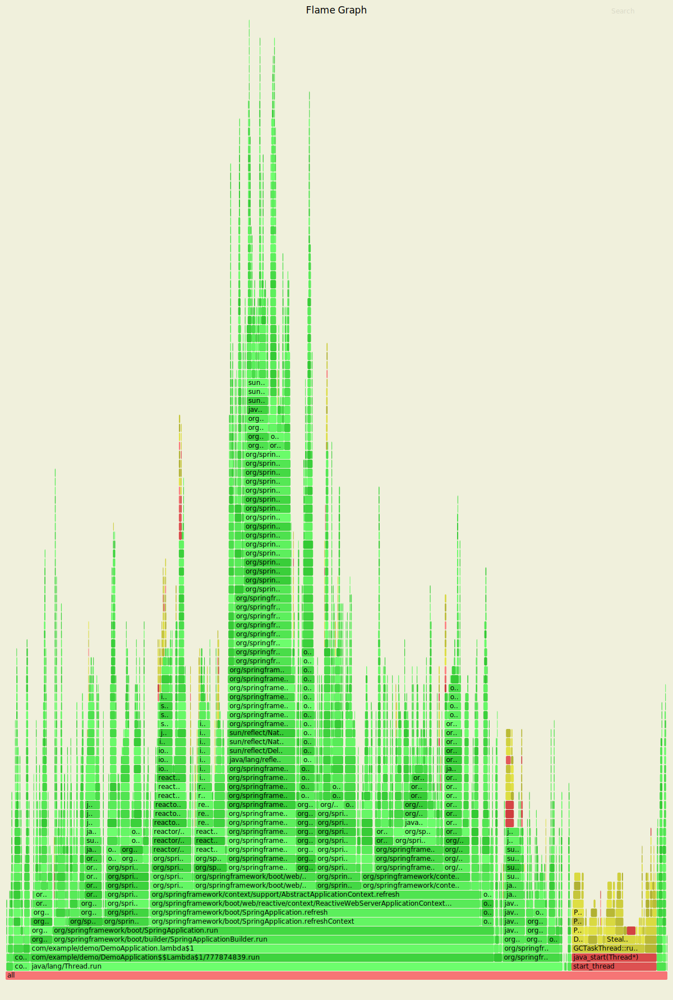
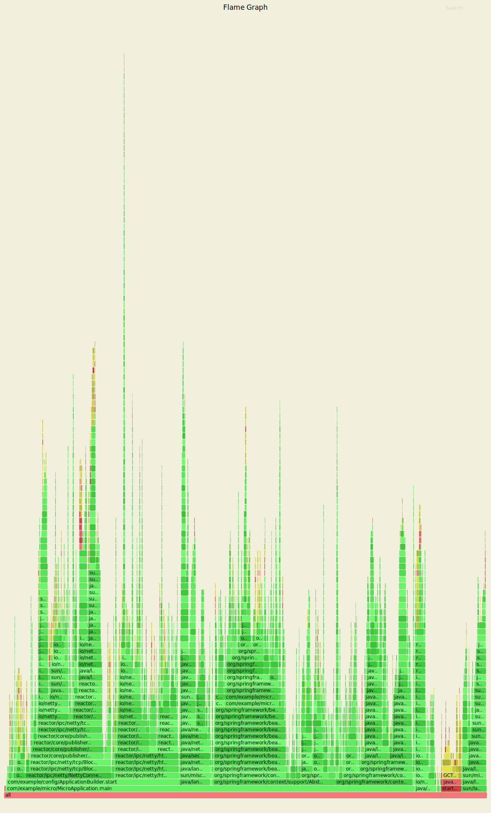
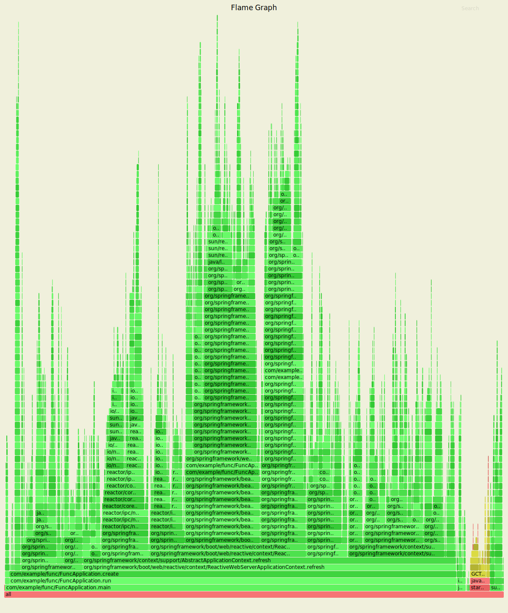
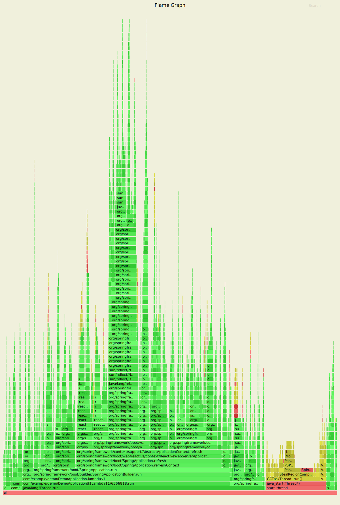

Laptop results:

```
Benchmark               Mode  Cnt  Score   Error  Units
MainBenchmark.isolated    ss   10  1.305 ± 0.162   s/op
MainBenchmark.shared      ss   10  0.257 ± 0.094   s/op
```

* "isolated" means a new class loader per application context (so all
the Spring metadata has to be read again because caches get cleared).
* "shared" means the same class loader for all contexts. In principal
this is as fast as we can ever go (things will always be a bit slower
because classes have to be loaded).

Without `spring.components`:

```
Benchmark               Mode  Cnt  Score   Error  Units
MainBenchmark.isolated    ss   10  1.331 ± 0.145   s/op
MainBenchmark.shared      ss   10  0.290 ± 0.072   s/op
```

The error bars are large, but there may be a small difference that is
worth keeping, even from such a minor change.

With `LazyInitBeanFactoryPostProcessor` (quite a useful boost):

```
Benchmark               Mode  Cnt  Score   Error  Units
MainBenchmark.isolated    ss   10  1.197 ± 0.188   s/op
MainBenchmark.shared      ss   10  0.226 ± 0.067   s/op
```

=== Desktop Results

Vanilla:

```
Benchmark               Mode  Cnt  Score   Error  Units
MainBenchmark.isolated    ss   10  0.768 ± 0.110   s/op
MainBenchmark.shared      ss   10  0.159 ± 0.048   s/op
```

and with `LazyInitBeanFactoryPostProcessor`:

```
Benchmark               Mode  Cnt  Score   Error  Units
MainBenchmark.isolated    ss   10  0.696 ± 0.068   s/op
MainBenchmark.shared      ss   10  0.131 ± 0.024   s/op
```

== GC Data

Run the app with `-verbose:gc -XX:+PrintGCDetails
-XX:+PrintGCTimeStamps` to see GC pauses. E.g.

```
1.595: [Full GC (System.gc()) [PSYoungGen: 2080K->0K(23552K)] [ParOldGen: 11028K->11106K(55296K)] 13109K->11106K(78848K), [Metaspace: 23083K->23083K(1071104K)], 0.0511875 secs] [Times: user=0.15 sys=0.00, real=0.05 secs] 
```

Total time 200ms.

== Flame Graphs

Download the https://github.com/jvm-profiling-tools/async-profiler[profiler] and run the app with these arguments:

```
-agentpath:<path-to>/async-profiler/build/libasyncProfiler.so=start,svg,file=/tmp/flame.svg,event=cpu,interval=100000 -Ddemo.close=true -Xmx128m -noverify -XX:TieredStopAtLevel=1
```

> HINT: you can click on the flames to zoom in on the stack above
> where you click.



Same but with the `LazyInitBeanFactoryPostProcessor`:

image::images/flame_lazee.svg[lazy]

Notice the different (thinner) profile for the right hand "rump"
containing `ConfigurationClassPostProcessor`.

There is a `MicroApplication` (no `@Configuration` and no Spring Boot)
that starts up very quickly. Here's a flame graph:



Note that there is very little time spent on garbage collection, and
of course nothing from `ConfigurationClassPostProcessor`.

== Ideas

* Up to now the strategy has been "use ASM and cache like crazy, run
everything dynamically". What about precomputing all that stuff?

* `@ComponentScan` -> `spring.components` and it seems to make very
little difference (but every little helps).

* What about `@Import`? A large fraction of configuration class
processing is taken up with `@Import`.

* `BeanInfoFactory` isn't a big footprint on the flame graphs, but
it's not minute either.

* `ConfigurationClassPostProcessor` does a lot of imports and metadata
reading. It always shows up in the flame graphs.

* CGILib: might not be slow at all actually, but it comes in for some
stick generally. Worth a look.

* Webflux is the other big hog in the simple demo application, after
from `@Configuration` (Netty itself is relatively fast). Maybe that
can be streamlined as well?

Sifting through some flame graphs and other hints and data points, we
came to the conclusion that there are maybe 3 areas that are worth
some more research:

* `ConfigurationClassPostProcessor` is definitely up there and you can
quite easily change the `MetadataReaderFactory` it uses (Spring Boot
already boosts performance that way). We tried to serialize the
metadata, but the existing implementation is not serializable and
cannot easily be made so. There are some concerns about the fragility
of the annotation metadata implementations that are in use already
(one is ASM based and the other needs classes to be loaded). We need
the ASM-generated data for `ConfigurationClassPostProcessor`.

* CGLib *is* a bit slow, compared to vanilla reflective access. So
replacing the proxies in `@Configuration` processing might be a good
idea. Phil had some code that did this but he thought it didn't make
enough difference to continue (see
https://github.com/philwebb/spring-framework/tree/config-processor[here]).

* Bean creation is expensive still. `BeanWrapper` and `BeanInfo` are
right in the centre of that. There is a `BeanInfo` implementation in
this project (from Phil again) but it doesn't have any measurable
effect. Something else might work. The place to start looking is
`AbstractAutowireCapableBeanFactory` where the `doCreateBean()` method
could be replaced.

* Also Spring Boot condition messages create strings and concatenate
them even if they might never be used. this shows up a GC churn.

== Functional Bean Registration

Getting rid of as much `@Configuration` as possible would give us a
way to measure the effect of any inefficiencies in that area more
precisely. Here are some results:

```
Benchmark               Mode  Cnt  Score   Error  Units
MainBenchmark.isolated    ss   10  1.373 ± 0.192   s/op
MainBenchmark.boot        ss   10  1.309 ± 0.216   s/op
MainBenchmark.manual      ss   10  1.235 ± 0.180   s/op
MainBenchmark.func        ss   10  0.858 ± 0.138   s/op
```

* "isolated" is the canonical `DemoApplication` with `@SpringBootApplication`.

* "boot" uses `SpringApplication` but not
`@EnableAutoConfiguration`. It is a bit quicker (70ms or 5%). The
flame graph for this one has much less GC activity.

* "manual" is the same but gets rid of `SpringApplication`. Another
70ms improvement.

* "func" registers as many as possible of the beans in the application
using the functional bean registration API. Results are pretty good
(first sample under 1000ms).

Some of the `@Configuration` beans are hard to use without registering
them as beans
(e.g. `WebFluxAutoConfiguration.EnableWebFluxConfiguration`). If you
do register a `@Configuration` manually (not using `@Import` or
`@ComponentScan`) there is still some post processing and relective
calling of `@Bean` methods etc., but the CGLib proxy is skipped (might
have side effects, so probably not a good idea in general).

Here's a flame graph from the "func" sample:



Note that `ConfigurationClassPostProcessor` still accounts for 15% of
the startup time, so there is still some work to do to push that down.

The `FuncApplication`

== Hacking AbstractAutowureCapableBeanFactory

See https://jira.spring.io/browse/SPR-16918[SPR-16918]. This little hack:

```java
//            PropertyDescriptor[] filteredPds = filterPropertyDescriptorsForDependencyCheck(
//                    bw, mbd.allowCaching);
            PropertyDescriptor[] filteredPds = new PropertyDescriptor[0];
```

makes things really zippy:

```
Benchmark               Mode  Cnt  Score   Error  Units
MainBenchmark.boot        ss   10  1.145 ± 0.192   s/op
MainBenchmark.func        ss   10  0.725 ± 0.187   s/op
MainBenchmark.isolated    ss   10  1.234 ± 0.195   s/op
MainBenchmark.shared      ss   10  0.227 ± 0.070   s/op
```

You can even start the `FuncApplication` in 12m heap without degrading
it. It runs in 8m but a bit slower, much slower in 8m, and fails to
start in 4m. GC is down to 3% of startup time in the "func" sample,
and 8% in "isolated" (the fully-leaded `DemoApplication`).

== Serializable Class Metadata

Using Kryo we were able to cache and re-load configuration class
metadata using a custom `MetadataReaderFactory`. The results are so
far inconclusive. The cost of serialization is close to the cost
of the ASM processing, so nothing is gained.

```
Benchmark               Mode  Cnt  Score   Error  Units
MainBenchmark.isolated    ss   10  1.294 ± 0.095   s/op
MainBenchmark.shared      ss   10  0.264 ± 0.075   s/op
```

Flame graphs with `alloc=cpu`, with the cache:



Notice the large fraction of the samples in `GCTaskThread::run`
(19.47% of the total startup time). These graphs were generated using
the agent, so it captures the startup and only one application context
lifecycle, and with a higher sampling rate:

```
java 
```

The cached flamegraph doesn't look very different from the vanilla
one. The metadata in the cache probably contains all the warts of the
dynamically computed one, in terms of memory usage. It still has all
those ASM `Type` instances for example, so maybe we need a more
efficient representation of `AnnotationMetadata` and `ClassMetadata`
to take advantage of this kind of strategy.

Raw benchmarks for different metadata reading strategies:

```
Benchmark                     Mode  Cnt   Score    Error  Units
MetadataBenchmark.caching    thrpt   10  29.240 ± 13.408  ops/s
MetadataBenchmark.kryo       thrpt   10  65.272 ± 24.374  ops/s
MetadataBenchmark.reference  thrpt   10  48.779 ± 23.635  ops/s
MetadataBenchmark.simple     thrpt   10  27.544 ± 13.063  ops/s
```

The error bars are large but the averages are consistent between
runs. It's still warming up the JIT as it runs and it's not clear we
actually want it to be warm (it will never be warm on a cold
start). Key:

* "caching": used by Spring by default (and for `@ComponentScan` also in Spring Boot)

* "kryo": is the special cache of serialized metadata

* "reference": used by Spring Boot for `ConfigurationClassPostProcessor`, efficient reference-based cache of the ASM data

* "simple" is the raw ASM reader.

== Bean Creation Benchmarks

Create a `Bean` and inject a `Foo` into it:

```
Benchmark                       Mode  Cnt           Score           Error  Units
BeanCreationBenchmark.bare     thrpt    5  2863559599.756 ± 283985900.459  ops/s
BeanCreationBenchmark.cglib    thrpt    5      516603.359 ±      6503.198  ops/s
BeanCreationBenchmark.proxy    thrpt    5      565993.698 ±     53195.230  ops/s
BeanCreationBenchmark.reflect  thrpt    5     9968507.609 ±    133542.774  ops/s
BeanCreationBenchmark.simple   thrpt    5     4066914.320 ±    589505.416  ops/s
```

Key:

* "bare": just uses `new MyBean(foo)`

* "cglib": creates a CGLib proxy of `MyBean` and calls `setFoo(foo)`

* "proxy": same but for a JDK proxy

* "reflect": calls the constructor reflectively

* "simple": uses `DefaultListableBeanFactory.createBean()` to create a `MyBean` instance

Learnings:

* Proxies are slow - almost 20 times slower than vanilla reflection. CGLib isn't much different than JDK proxies (it used to be much slower).

* The `BeanFactory` is more than twice as slow as manually using reflection to create the bean. The difference might be in the use of `BeanInfo`, which always shows up on flame graphs.

* Reflection is 300 times slower than pure compiled bytecode.

A factor of 2 is almost not worth chasing at this level. A factor of
20 probably is. Ditto 300. So we should try to avoid proxies as much
as possible, and reflection. These results are probably independent of
the GC issues experienced by the full Spring Boot application startup.